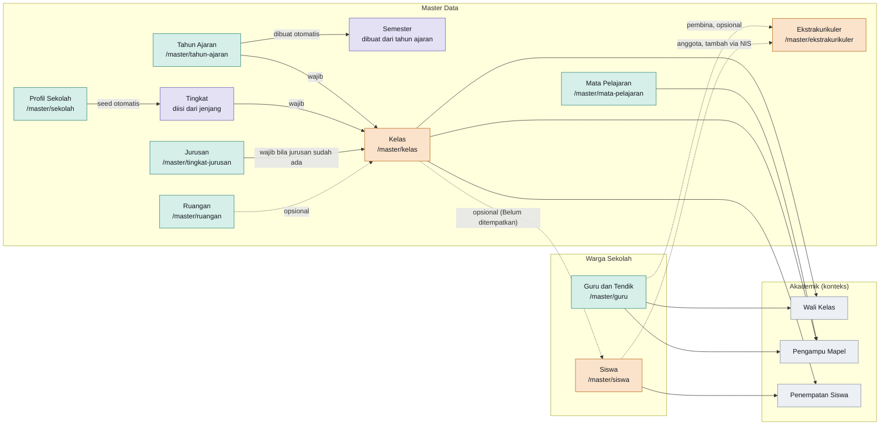
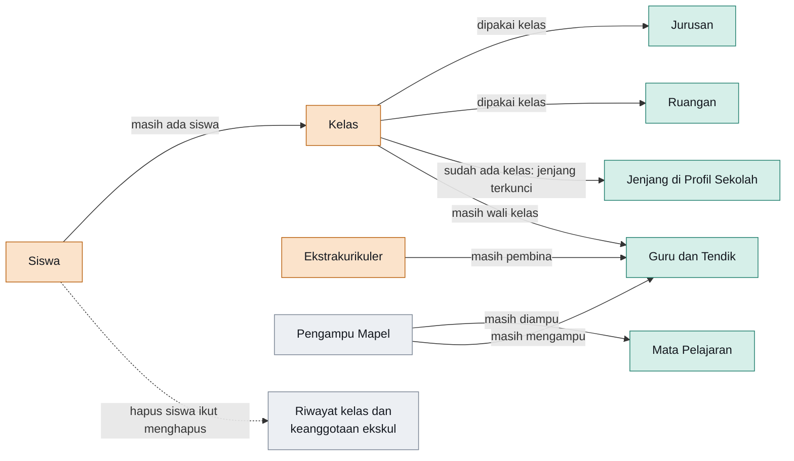
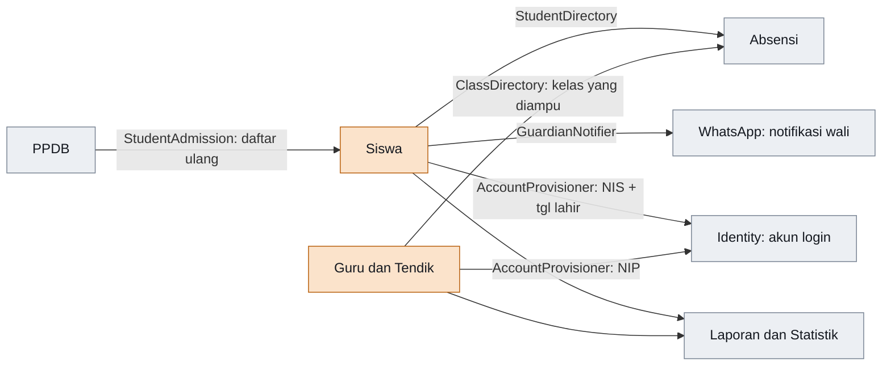

# Dependensi halaman Master Data dan Warga Sekolah

Dibaca dari route, FormRequest, action, dan model di `modules/Core` (belum dicoba di aplikasi yang berjalan). Tidak ada foreign key di database; semua syarat dan penjaga hapus ditegakkan di request dan action.

**Cara membaca diagram:** panah menunjuk dari data yang **harus ada lebih dulu** ke halaman yang membutuhkannya. Garis solid = wajib, garis putus-putus = opsional.

- **Hijau**: berdiri sendiri, bisa diisi tanpa data lain.
- **Ungu**: turunan otomatis, tidak diisi manual.
- **Oranye**: bergantung pada data lain.
- **Abu-abu**: halaman Akademik (di luar Master Data), hanya untuk konteks.

## 1. Prasyarat membuat data baru

## 2. Prasyarat per halaman

| Halaman | Grup | Wajib ada dulu | Opsional | Hanya dibaca untuk tampilan |
| --- | --- | --- | --- | --- |
| Profil Sekolah | Master Data | tidak ada | tidak ada | tidak ada |
| Tahun Ajaran | Master Data | tidak ada | tidak ada | tidak ada |
| Semester | Master Data | Tahun Ajaran (barisnya lahir dari tahun ajaran; hanya bisa diubah) | tidak ada | tidak ada |
| Tingkat | Master Data | Profil Sekolah (jenjang menentukan isinya; tidak diedit manual) | tidak ada | Tahun Ajaran aktif |
| Jurusan | Master Data | tidak ada | tidak ada | tidak ada |
| **Kelas** | Master Data | Tahun Ajaran, Tingkat; Jurusan bila sudah ada jurusan | Ruangan | tidak ada |
| **Mata Pelajaran** | Master Data | **tidak ada** | tidak ada | nama Tingkat |
| Ruangan | Master Data | tidak ada | tidak ada | tidak ada |
| Ekstrakurikuler | Master Data | tidak ada | Guru (pembina); Siswa untuk anggota | tidak ada |
| **Siswa** | Warga Sekolah | tidak ada | Kelas tahun ajaran aktif, tanggal lahir, NISN, data wali | tidak ada |
| **Guru dan Tendik** | Warga Sekolah | tidak ada | NIP, NUPTK, email | tidak ada |

Field wajib sendiri: Siswa butuh nama, NIS (unik per sekolah), dan jenis kelamin; Guru butuh nama, status kepegawaian, dan tugas. NISN dan NIP bila diisi juga harus unik per sekolah.

### Jawaban atas contoh Mata Pelajaran

Membuat mata pelajaran baru **tidak membutuhkan data Siswa maupun Guru**. `SubjectRequest` hanya memvalidasi kode, nama, kelompok, dan KKM. Siswa dan Guru baru terlibat di Akademik › Pengampu Mapel, yang butuh Mata Pelajaran, Guru, dan Kelas. Itu langkah terpisah dan tidak menghalangi pembuatan mapel.

## 3. Penjaga hapus: siapa mengunci siapa

Panah menunjuk dari data yang masih memakai ke data yang **tidak bisa dihapus** selama dipakai.

Dua aturan di luar diagram: Tahun Ajaran hanya bisa dihapus saat berstatus draf, dan hapus Kelas ikut membersihkan baris pengampunya.

## 4. Siapa memakai Siswa dan Guru

Siswa dan Guru adalah data paling banyak dipakai. Modul lain tidak mengimpor model Core; semuanya lewat kontrak (DTO), sesuai aturan modular monolith.

Akibatnya, mengubah NIS atau NIP ikut mengubah nama pengguna akun login, dan siswa yang lulus, pindah, atau keluar otomatis dinonaktifkan akunnya.
